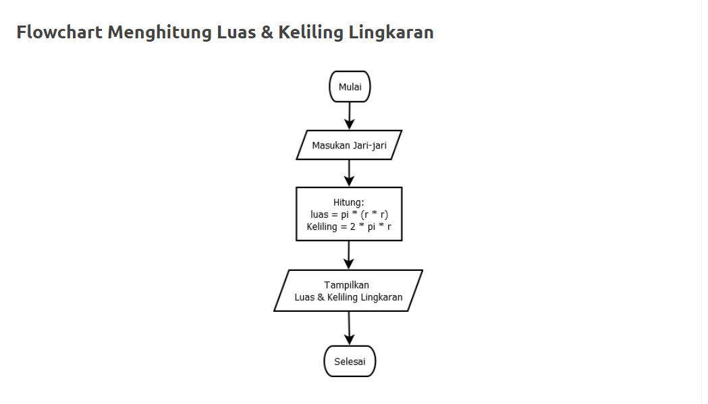

# Praktikum3
# Langkah-langkah :

- Buat Repository di Github "Praktikum3".

- Buat Kode program untuk menghitung Luas dan keliling lingkaran python di Visual code.

- Buat Flowchart dan menjelaskan program dan keliling lingkaran.

- Lalu screenshot hasil eksekusi Program dan Flowchart.

- Simpan project ke Repository Praktikum3 di Github.

<h1>Ini adalah tampilan Kode program dan Flowchart Luas dan keliling lingkaran :
  

